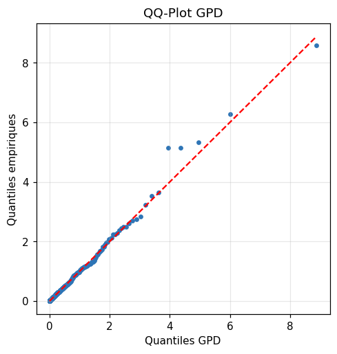
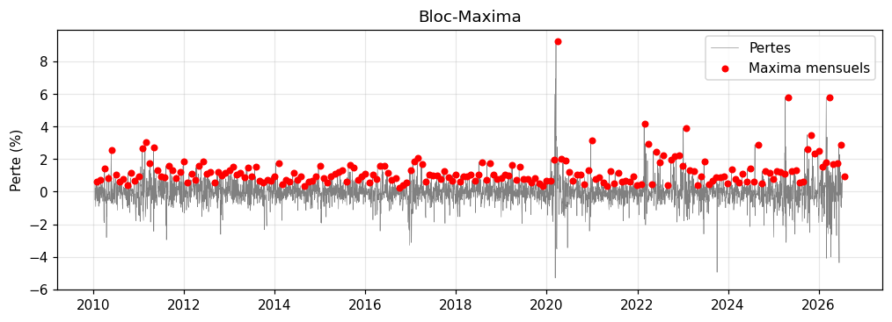

<div align="center">

<br>


<br><br>

# 𝐀 𝐓 𝐋 𝐀 𝐒

### T A I L   R I S K   &nbsp;·&nbsp;  M A R G I N   T E R M I N A L

<sub>◆ &nbsp;MASI 20 INDEX &nbsp;◆&nbsp; CASABLANCA STOCK EXCHANGE &nbsp;◆</sub>

<br>


<br>

`GEV` `POT` `GARCH-EVT` `HMM` `MONTE CARLO`

<br>

**Master MMSD — FST Tanger**
Achraf Akiyaf · Supervised by Prof. AZMANI Abdellah

<br>

━━━━━━━━━━━━━━━━━━━━━━━━━━━━━━━━━━━━━━━━━━

</div>

<br>

<div align="center">

### *"Naive models sleep through crashes. ATLAS doesn't."*

</div>

<br>

## ◆ &nbsp;OVERVIEW

**ATLAS** is a real-time tail-risk and margin desk built on the **MASI 20** index. It stacks four risk models of increasing sophistication — Gaussian → Historical → **Extreme Value Theory (POT)** → **GARCH-EVT** — to demonstrate why naive models systematically underestimate crash risk, and to compute the capital a trading desk should actually hold against it.

Every number on screen is backed by a full statistical diagnostic suite underneath — not decoration, but proof.

<br>

━━━━━━━━━━━━━━━━━━━━━━━━━━━━━━━━━━━━━━━━━━

<br>

## ◆ &nbsp;LIVE TERMINAL

<sub>One continuous dashboard, scrolled top to bottom ↓</sub>

<br>


**① Header & KPIs**
<sub>Spot MASI · GARCH volatility · VaR 99% EVT · recommended capital per contract</sub>

<br>


**② Market View**
<sub>Price · Bollinger bands · VaR 99% threshold overlay · COVID crash marker</sub>

<br>


**③ Risk Gauge & Model Stack**
<sub>Crash warning gauge · Gaussian → Historical → EVT → GARCH-EVT comparison</sub>

<br>


**④ What-If Stress Test & Position Simulator**
<sub>Volatility shock slider · real-time margin recalculation · LONG/SHORT simulator</sub>

<br>


**⑤ Drawdown & Regime Detection**
<sub>Cumulative loss since last peak (worst: −37.6%) · HMM market regimes</sub>

<br>


**Margin Stress Scenarios**
<sub>Vol +100% · Flash crash · COVID 2020 — normal vs. stressed margin</sub>

<br>

━━━━━━━━━━━━━━━━━━━━━━━━━━━━━━━━━━━━━━━━━━

<br>

## ◆ &nbsp;METHODOLOGY

<div align="center">

| Layer | Model | Purpose |
|:---:|:---:|:---|
| `01` | **GARCH(1,1)** | Conditional volatility, captures clustering |
| `02` | **GEV / POT** | Extreme value tail estimation |
| `03` | **GARCH-EVT** | Combined — conditional vol × fat tail |
| `04` | **HMM** | Latent market regime detection |
| `05` | **Monte Carlo** | 10,000+ simulated loss paths |

</div>

<br>

<div align="center">

### VaR 99% (1-day) — the escalation that matters

| Gaussian | Historical | EVT (POT) | GARCH-EVT |
|:---:|:---:|:---:|:---:|
| 1.70% | 1.92% | 2.04% | **2.26%** |
| *naive* | *better* | *tail-aware* | ***honest*** |

</div>

<blockquote>
Each step up the chain adds risk the previous model was blind to. The gap between <b>1.70%</b> and <b>2.26%</b> is exactly the capital a desk using Gaussian VaR would be missing on the worst days.
</blockquote>

<br>

━━━━━━━━━━━━━━━━━━━━━━━━━━━━━━━━━━━━━━━━━━

<br>

## ◆ &nbsp;EVT DIAGNOSTICS

<details open>
<summary><b>Click to explore the full statistical validation suite</b></summary>

<br>

<table>
<tr>
<td width="50%" align="center">

<sub><b>QQ-Plot</b> — GPD tail goodness-of-fit</sub>
</td>
<td width="50%" align="center">

<sub><b>Block Maxima</b> — GEV fit on monthly extremes</sub>
</td>
</tr>
<tr>
<td width="50%" align="center">

<sub><b>Return Level Plot</b> — expected extreme by return period</sub>
</td>
<td width="50%" align="center">

<sub><b>Monte Carlo</b> — simulated MPOR loss distribution</sub>
</td>
</tr>
</table>


<sub><b>Mean Residual Life & Parameter Stability</b> — threshold selection for POT</sub>

<br>


<sub><b>Conditional VaR 99% (GARCH-EVT)</b> — dynamic threshold overlaid on daily returns, 2010–2026</sub>

</details>

<br>

━━━━━━━━━━━━━━━━━━━━━━━━━━━━━━━━━━━━━━━━━━

<br>

## ◆ &nbsp;KEY FIGURES

<div align="center">

| 📉 Worst Drawdown | 🔥 Worst Day | 💰 Capital / Contract |
|:---:|:---:|:---:|
| **−37.6%** | **−9.23%** <sub>(16/03/2020)</sub> | **8,652 MAD** |

</div>

<br>

━━━━━━━━━━━━━━━━━━━━━━━━━━━━━━━━━━━━━━━━━━

<br>

## ◆ &nbsp;FEATURES

- 📈 Live VaR 99% (EVT) and recommended capital per contract
- 🔥 **"Replay worst day"** — one-click simulation of the 16/03/2020 crash
- 🎚️ **What-If stress testing** — real-time volatility shock slider
- 🎲 **Position simulator** — LONG/SHORT margin requirements *(illustrative only)*
- 📉 **Drawdown tracker** with historical stress bands
- 🧩 **HMM regime detection** — calm / turbulent / crash states
- 📄 One-click PDF risk report generation

<br>

━━━━━━━━━━━━━━━━━━━━━━━━━━━━━━━━━━━━━━━━━━

<br>

## ◆ &nbsp;PROJECT STRUCTURE

```
masi-tail-risk-lab/
├── .github/workflows/ci.yml        CI pipeline (pytest on push/PR)
├── app/
│   └── dashboard.py                 Streamlit application
├── data/
│   ├── raw/                         Raw MASI historical data
│   └── processed/                   Cleaned, feature-engineered data
├── notebooks/
│   ├── 01_data_exploration.ipynb
│   ├── 02_evt_modeling.ipynb         GEV / POT fitting, diagnostics
│   ├── 03_margin_model.ipynb         Capital / margin engine
│   ├── 04_backtesting.ipynb
│   └── 05_conditional_margin_stress.ipynb
├── src/
│   ├── __init__.py
│   └── backtest.py
├── images/                          Dashboard & diagnostic figures
├── report/
│   └── RESULTATS_CLES.md
└── requirements.txt
```

<br>

━━━━━━━━━━━━━━━━━━━━━━━━━━━━━━━━━━━━━━━━━━

<br>

## ◆ &nbsp;QUICK START

```bash
git clone https://github.com/achrafaky/atlas-tail-risk-terminal.git
cd atlas-tail-risk-terminal
pip install -r requirements.txt
streamlit run app/dashboard.py
```

App runs at `http://localhost:8501`

```bash
pytest -q          # run the test suite
```

<br>

━━━━━━━━━━━━━━━━━━━━━━━━━━━━━━━━━━━━━━━━━━

<br>

<div align="center">

## ⚠ DISCLAIMER

*This project is for academic and research purposes only.*
*The position simulator draws randomly from the historical distribution*
*and does not constitute financial or trading advice.*

<br>

━━━━━━━━━━━━━━━━━━━━━━━━━━━━━━━━━━━━━━━━━━

<br>

### Achraf Akiyaf


<sub>Built with Python, Streamlit, GARCH, EVT, HMM — and a healthy respect for fat tails.</sub>

<br>

**◆ ATLAS RISK TERMINAL ◆**

</div>

